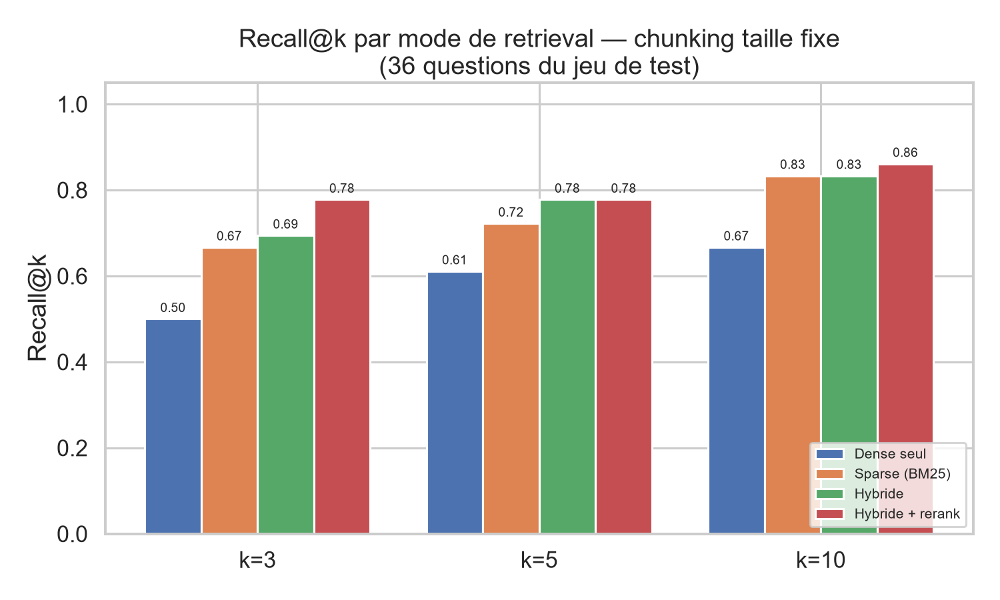
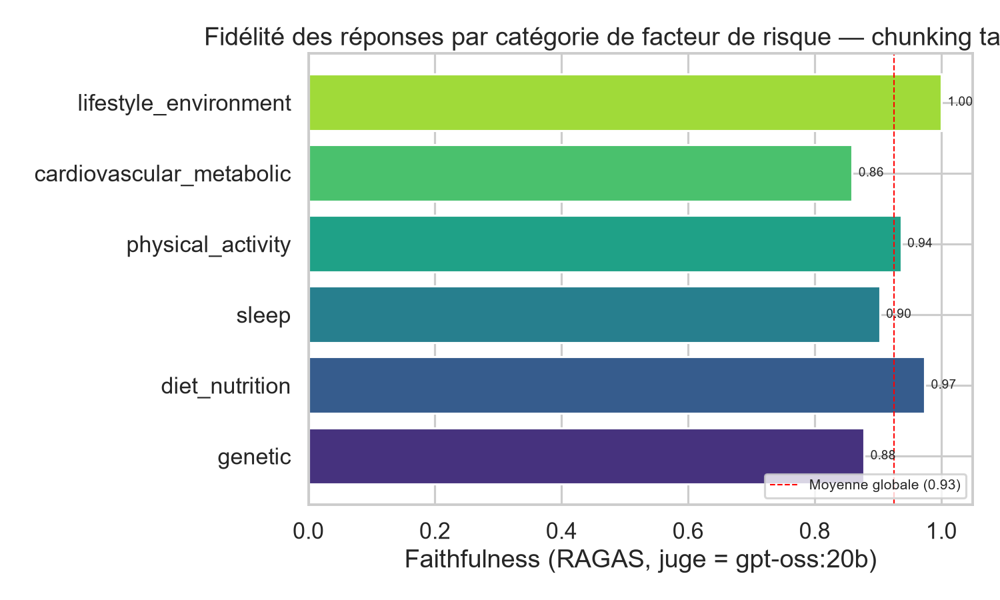
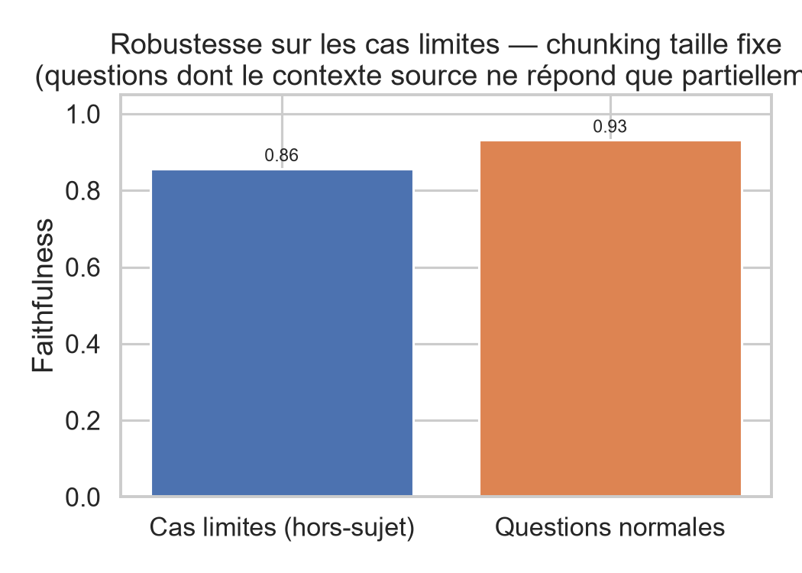
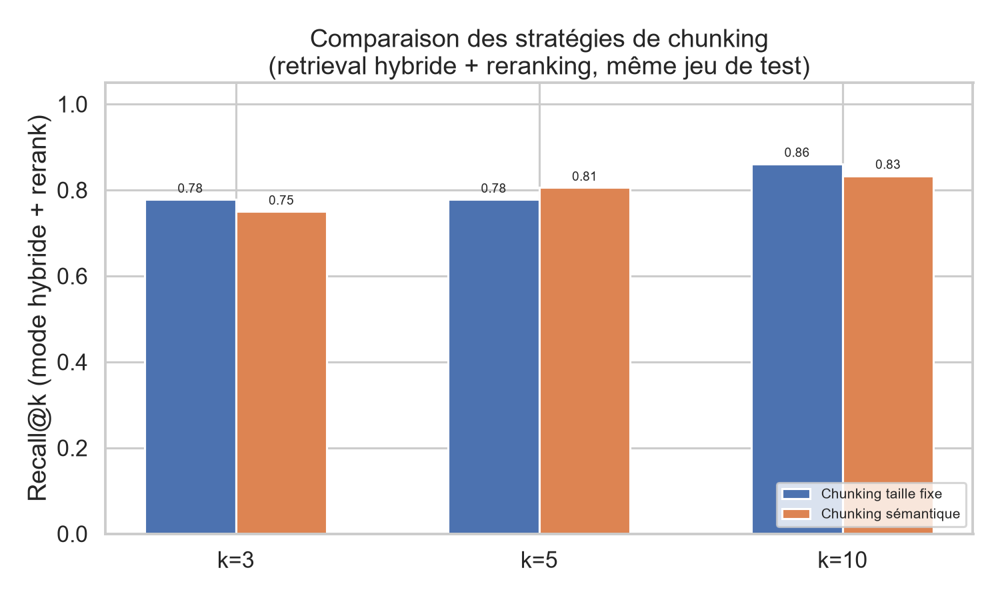
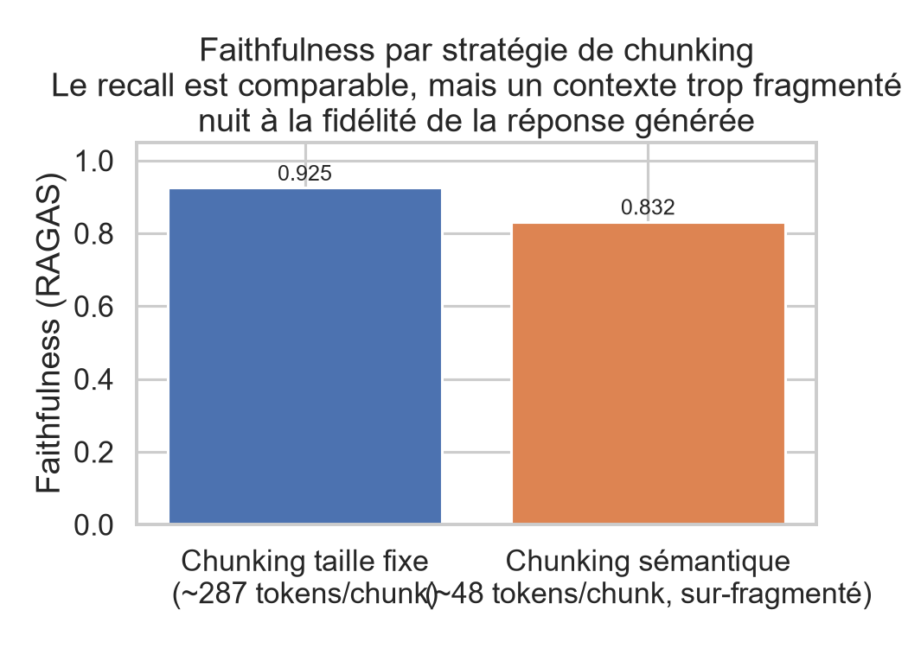
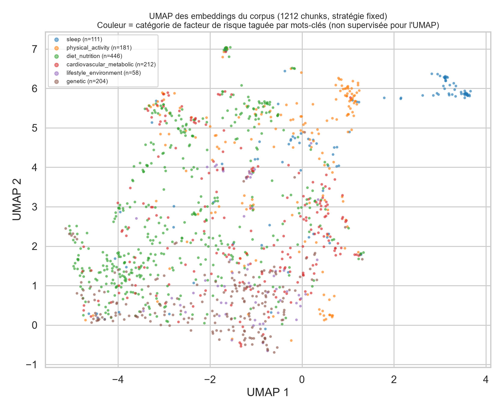

# Alzheimer Risk Factors RAG

🚧 **Projet en cours de construction — commits progressifs, voir l'historique git pour la démarche.**

Assistant de question-réponse sourcé sur la littérature scientifique des facteurs de risque
de la maladie d'Alzheimer (génétique, mode de vie, métabolique, cardiovasculaire, sommeil,
activité physique), construit à partir d'un corpus PubMed réel — avec évaluation quantitative
du retrieval et de la fidélité des réponses, pas juste une démo qui a l'air de marcher.

## Pourquoi ce projet
Voir [`PLAN.md`](PLAN.md) pour la démarche complète (architecture, choix méthodologiques, étapes).

## État d'avancement
- [x] Ingestion PubMed (1198 abstracts, API E-utilities)
- [x] Chunking — 2 stratégies comparées (taille fixe vs découpage sémantique)
- [x] Embeddings + indexation ChromaDB (local, gratuit)
- [x] Retrieval hybride (dense + BM25, fusion RRF)
- [x] Reranking (cross-encoder)
- [x] Génération sourcée avec garde-fous anti-hallucination (Ollama, 100% local)
- [x] Jeu de test d'évaluation (36 questions, généré semi-automatiquement puis relu)
- [x] Évaluation quantitative (recall@k, faithfulness via RAGAS, LLM-as-judge séparé)
- [x] Figures scientifiques (comparaison chunking/retrieval, faithfulness par catégorie)
- [x] Visualisation UMAP des embeddings
- [x] Comparaison RAG vs zero-shot (n=10, +88% de correctness)
- [x] API FastAPI (`src/api.py` — `/health`, `/ask`)
- [x] Tests + CI GitHub Actions (23 tests, mocks sur Ollama/ChromaDB pour rester rapides et gratuits)
- [ ] Dockerfile + docker-compose
- [ ] README final avec démo (GIF/vidéo)

## Résultats

Évaluation sur 36 questions (générées semi-automatiquement à partir du corpus, relues et
corrigées manuellement — voir `eval/testset.jsonl`), juge de faithfulness (RAGAS) = `gpt-oss:20b`,
**différent** du modèle générateur (`qwen3:14b`), pour éviter le biais d'auto-évaluation.

### Retrieval — ablation par composant (chunking taille fixe)



| Mode | Recall@3 | Recall@5 | Recall@10 |
|---|---|---|---|
| Dense seul | 0.50 | 0.61 | 0.67 |
| Sparse (BM25) | 0.67 | 0.72 | 0.83 |
| Hybride (dense+BM25, RRF) | 0.69 | 0.78 | 0.83 |
| **Hybride + reranking** | **0.78** | 0.78 | **0.86** |

Chaque étape du pipeline apporte un gain mesurable. Fait notable : BM25 seul bat le dense seul —
les questions reprennent souvent le vocabulaire technique exact des abstracts (APOE, termes MeSH),
que la recherche lexicale capture très bien.

### Fidélité des réponses (faithfulness)

**0.925** en moyenne (chunking taille fixe) — chaque affirmation de la réponse est vérifiée par le
juge comme réellement supportée par le contexte cité, pas juste "à l'air plausible".



Sur les questions-pièges (cas où l'abstract source ne répond que partiellement à la question),
la faithfulness baisse légèrement (0.856 vs 0.931) — signe que le système est bien plus prudent
face à un contexte ambigu, comportement attendu du garde-fou :



### Chunking : taille fixe vs sémantique

Le chunking sémantique **sur-fragmente** les abstracts courts (~48 tokens/chunk en moyenne contre
~287 pour le chunking taille fixe) — le sujet glisse naturellement entre les phrases d'un abstract
(contexte → méthode → résultats), donc la similarité cosine entre phrases consécutives tombe vite
sous le seuil et le découpage coupe presque à chaque phrase.

Résultat : le recall@k reste comparable entre les deux stratégies...



...mais la faithfulness s'effondre nettement avec le chunking sémantique (0.832 vs 0.925) : un
contexte trop morcelé nuit à la cohérence de la synthèse du LLM générateur, même quand le bon
document est techniquement retrouvé.



**Conclusion** : le chunking sémantique n'est pas une amélioration universelle — il faut l'ajuster
à la longueur des documents source. Sur des abstracts courts et déjà denses, le chunking à taille
fixe est le meilleur choix. Il donnerait probablement de meilleurs résultats sur des documents
longs (full-text), à tester dans une itération future.

### Structure sémantique du corpus (UMAP)



Projection UMAP (384 → 2 dimensions) des 1212 chunks indexés, colorés par catégorie de facteur de
risque taguée automatiquement par mots-clés (le tagging n'intervient à aucun moment dans le calcul
de l'UMAP, qui ne voit que le texte). Les catégories les plus spécifiques et les moins fréquentes
(sommeil, activité physique) forment des clusters visuellement nets et isolés — signe que l'espace
d'embedding capture un vrai signal sémantique cohérent avec le tagging. Le reste du corpus (mode
de vie, génétique, cardio-métabolique, diète) se chevauche davantage, ce qui est attendu : un
abstract sur Alzheimer aborde très souvent plusieurs facteurs de risque à la fois (ex. un article
sur la diète cite aussi APOE ou le profil cardiovasculaire).


### RAG vs zero-shot : l'apport réel du retrieval

Même LLM générateur (`qwen3:14b`), avec pipeline RAG complet vs en zero-shot (connaissances
internes seules, aucun contexte fourni). Métrique : AnswerCorrectness (RAGAS, facticité pure vs
réponse de référence), jugée par `gpt-oss:20b` — même juge que les autres métriques du projet.
Échantillon réduit (10 questions sur les 36 du jeu de test complet, coût du LLM-as-judge en local
oblige) — indicatif, pas une preuve statistique définitive.

| Mode | AnswerCorrectness moyenne |
|---|---|
| Zero-shot (sans RAG) | 0.271 |
| **Avec RAG** | **0.509** |

Le RAG améliore la correctness sur 8 des 10 questions testées (+88% en moyenne). Le seul cas net
où le zero-shot fait mieux concerne une question de connaissance générale bien établie (facteurs
de risque vasculaires classiques : diabète, hypertension, tabac) — le LLM la connaît déjà sans
avoir besoin du corpus, et le contexte récupéré ajoute plutôt du bruit ici.

Détails par question : `eval/results/rag_vs_zeroshot_fixed_1789057726.json`.

## Stack
Python · Ollama (LLM + embeddings, local) · ChromaDB · rank_bm25 · sentence-transformers
(reranking) · RAGAS (évaluation) · FastAPI · pytest + GitHub Actions (CI) · Streamlit (à venir)

## Lancer en local

```bash
python -m venv .venv
./.venv/Scripts/activate  # ou source .venv/bin/activate sur Linux/Mac
pip install -r requirements.txt

# 1. Ingestion du corpus PubMed
python src/ingest.py --max-records 1200

# 2. Chunking (2 stratégies)
python src/chunking.py --strategy fixed
python src/chunking.py --strategy semantic

# 3. Indexation vectorielle
python src/embed.py --strategy both

# 4. Chat interactif
python src/chat.py --strategy fixed

# 5. API HTTP (optionnel)
uvicorn src.api:app --reload --port 8000
# -> POST http://localhost:8000/ask {"query": "...", "strategy": "fixed"}
```

## Tests

```bash
pytest -q
```

23 tests unitaires (chunking, fusion RRF du retrieval, garde-fou de génération, contrat HTTP
de l'API), tous mockés sur les composants lourds (Ollama, ChromaDB, modèles d'embedding) pour
rester rapides (<1s) et gratuits en CI. CI GitHub Actions sur chaque push/PR (`.github/workflows/ci.yml`).

Nécessite [Ollama](https://ollama.com) avec un modèle de génération (`qwen3:14b` par défaut,
configurable dans `src/generate.py`) et le modèle juge pour l'évaluation (`gpt-oss:20b`).

## Structure

```
├── src/
│   ├── ingest.py       # récupération du corpus PubMed
│   ├── chunking.py     # 2 stratégies de découpage en chunks
│   ├── embed.py        # embeddings + indexation ChromaDB
│   ├── retrieval.py    # retrieval hybride dense + BM25
│   ├── rerank.py       # reranking cross-encoder
│   ├── generate.py     # génération sourcée + garde-fous
│   ├── chat.py         # mode interactif de test
│   └── api.py          # API FastAPI (/health, /ask)
├── tests/              # 23 tests unitaires (chunking, retrieval, génération, API)
├── .github/workflows/ci.yml  # CI GitHub Actions
├── eval/
│   ├── generate_testset.py  # génération semi-auto du jeu de test
│   ├── testset.jsonl         # jeu de test relu et validé (36 questions)
│   └── run_eval.py           # (à venir) métriques recall@k, faithfulness
└── PLAN.md              # plan détaillé et journal de décisions
```

## Limites (mises à jour au fil du projet)
- Le tagging automatique des catégories de facteurs de risque est fait par mots-clés, non
  mutuellement exclusif — la catégorie "genetic" (APOE) domine le corpus.
- Corpus limité aux abstracts (pas de full-text), donc contexte parfois incomplet.
- **Retrieval faible sur les questions en français** (corpus 100% anglais). Le retrieval dense
  (bi-encoder cross-lingual) reste correct, mais BM25 (composante sparse du mode hybride) est
  purement lexical sur les tokens anglais et ne matche pas "tabac"/"MA" contre smoking/AD — le
  score RRF chute sous le seuil de confiance et le système refuse plutôt que de mal répondre
  (comportement voulu du garde-fou, mais couverture linguistique à améliorer : traduction de la
  requête avant retrieval, ou embeddings multilingues dédiés).
